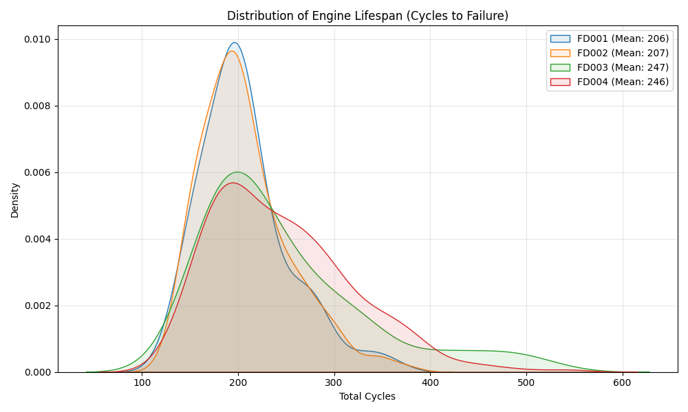
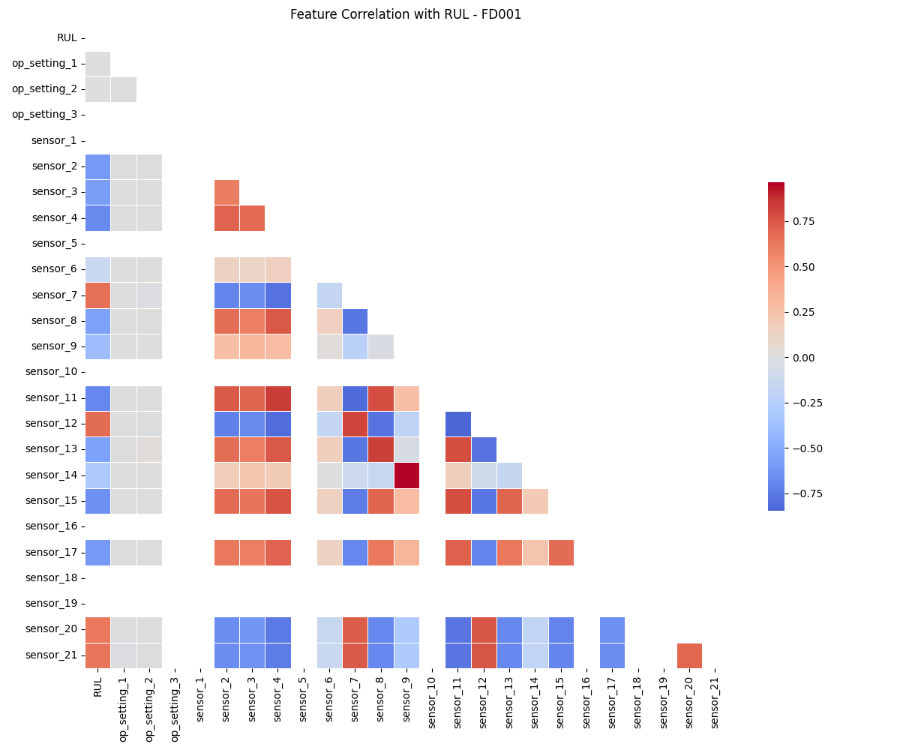
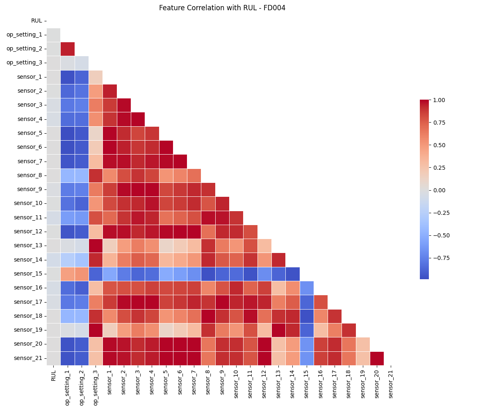
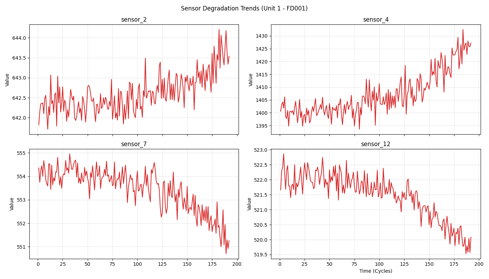
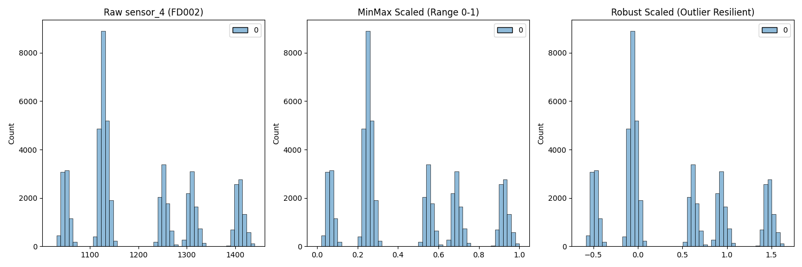

# NASA C-MAPSS Turbofan Engine Degradation Simulation Dataset

## Dataset Overview

**Dataset Name:** Turbofan Engine Degradation Simulation Data Set  
**Source:** NASA Ames Prognostics Center of Excellence (PCoE)  
**Simulation Tool:** C-MAPSS (Commercial Modular Aero-Propulsion System Simulation)  
**Engine Type:** 90,000-lb thrust class dual-spool commercial turbofan engine  
**Bypass Ratio:** ~8.4  
**Purpose:** Prognostics and Health Management (PHM), Remaining Useful Life (RUL) prediction

### Citation
> A. Saxena and K. Goebel (2008). "Turbofan Engine Degradation Simulation Data Set", NASA Prognostics Data Repository, NASA Ames Research Center, Moffett Field, CA

---

## Dataset Subsets

| Subset | Train Units | Test Units | Train Rows | Test Rows | Operating Conditions | Fault Modes |
|--------|-------------|------------|------------|-----------|---------------------|-------------|
| **FD001** | 100 | 100 | 20,631 | 13,096 | ONE (Sea level) | ONE (HPC Degradation) |
| **FD002** | 260 | 259 | 53,759 | 33,991 | SIX | ONE (HPC Degradation) |
| **FD003** | 100 | 100 | 24,720 | 16,596 | ONE (Sea level) | TWO (HPC + Fan Degradation) |
| **FD004** | 249 | 248 | 61,249 | 41,214 | SIX | TWO (HPC + Fan Degradation) |

**Total Training Rows:** ~160,359  
**Total Test Rows:** ~104,897

---

## Column Structure (26 Columns)

### Identification & Operational Settings (5 Columns)

| Column # | Column Name | Symbol | Description | Unit |
|----------|-------------|--------|-------------|------|
| 1 | **unit_number** | — | Engine unit identification number | — |
| 2 | **time_cycles** | — | Operational cycle number (time in cycles) | cycles |
| 3 | **op_setting_1** | alt | Altitude | ft |
| 4 | **op_setting_2** | Mach | Flight Mach number | — |
| 5 | **op_setting_3** | TRA | Throttle Resolver Angle | ° |

### Sensor Measurements (21 Columns)

| Column # | Sensor # | Symbol | Description | Unit | Location |
|----------|----------|--------|-------------|------|----------|
| 6 | **sensor_1** | T2 | Total temperature at fan inlet | °R | Fan Inlet |
| 7 | **sensor_2** | T24 | Total temperature at LPC outlet | °R | LPC Outlet |
| 8 | **sensor_3** | T30 | Total temperature at HPC outlet | °R | HPC Outlet |
| 9 | **sensor_4** | T50 | Total temperature at LPT outlet | °R | LPT Outlet |
| 10 | **sensor_5** | P2 | Pressure at fan inlet | psia | Fan Inlet |
| 11 | **sensor_6** | P15 | Total pressure in bypass-duct | psia | Bypass Duct |
| 12 | **sensor_7** | P30 | Total pressure at HPC outlet | psia | HPC Outlet |
| 13 | **sensor_8** | Nf | Physical fan speed | rpm | Fan Spool |
| 14 | **sensor_9** | Nc | Physical core speed | rpm | Core Spool |
| 15 | **sensor_10** | epr | Engine pressure ratio (P50/P2) | — | Calculated |
| 16 | **sensor_11** | Ps30 | Static pressure at HPC outlet | psia | HPC Outlet |
| 17 | **sensor_12** | phi | Ratio of fuel flow to Ps30 | pps/psi | Calculated |
| 18 | **sensor_13** | NRf | Corrected fan speed | rpm | Fan Spool |
| 19 | **sensor_14** | NRc | Corrected core speed | rpm | Core Spool |
| 20 | **sensor_15** | BPR | Bypass ratio | — | Calculated |
| 21 | **sensor_16** | farB | Burner fuel-air ratio | — | Burner |
| 22 | **sensor_17** | htBleed | Bleed enthalpy | — | Bleed System |
| 23 | **sensor_18** | Nf_dmd | Demanded fan speed | rpm | Control System |
| 24 | **sensor_19** | PCNfR_dmd | Demanded corrected fan speed | rpm | Control System |
| 25 | **sensor_20** | W31 | HPT coolant bleed (cool air flow) | lbm/s | HPT Cooling |
| 26 | **sensor_21** | W32 | LPT coolant bleed (cool air flow) | lbm/s | LPT Cooling |

---

## Engine Component Abbreviations

| Abbreviation | Full Name | Description |
|--------------|-----------|-------------|
| **LPC** | Low Pressure Compressor | Compressor on the low-pressure spool |
| **HPC** | High Pressure Compressor | Compressor on the high-pressure spool |
| **HPT** | High Pressure Turbine | Turbine on the high-pressure spool |
| **LPT** | Low Pressure Turbine | Turbine on the low-pressure spool |

---

## Data Characteristics

### File Structure
- **Training Data:** `train_FD00X.txt` (X = 1, 2, 3, 4)
- **Test Data:** `test_FD00X.txt`
- **RUL Labels:** `RUL_FD00X.txt` (ground truth for test data)
- **Format:** Space-separated text files, no headers

### Key Features
- **Run-to-Failure:** Training engines run until complete failure
- **Truncated Test Data:** Test engines stop at random point before failure
- **Initial Wear:** Each engine starts with unknown initial wear
- **Degradation:** Exponential degradation of efficiency and flow parameters
- **Operating Conditions:** Varying altitude, Mach number, and throttle settings
- **Failure Modes:** HPC degradation (FD001, FD002) and HPC + Fan degradation (FD003, FD004)

### Sensor Variability Notes
- Some sensors have **constant or near-constant values** in certain subsets
- Common practice: Remove low-variance sensors during preprocessing
- Sensors affected vary by subset (especially FD001 vs FD002/FD004)

---

## Operational Conditions

### Single Operating Condition (FD001, FD003)
- Sea level altitude
- Constant Mach number
- Single operating regime

### Multiple Operating Conditions (FD002, FD004)
- **Altitude Range:** Sea level to 40,000 ft
- **Mach Number Range:** 0 to 0.90
- **Temperature Range:** -60°F to 103°F
- **Six Different Flight Conditions**

---

## Typical Data Preprocessing Steps

1. **Load data** (no headers, space-separated)
2. **Add column names** (unit_number, time_cycles, op_setting_1-3, sensor_1-21)
3. **Remove constant sensors** (e.g., sensors with std < threshold)
4. **Normalize/Standardize** sensor values
5. **Create RUL labels** for training data (countdown to failure)
6. **Handle varying sequence lengths**
7. **Feature engineering** (optional: rolling statistics, polynomial features)

---

## Use Cases

- **Predictive Maintenance:** Predict when engine will fail
- **Anomaly Detection:** Identify abnormal engine behavior
- **Time Series Forecasting:** Forecast sensor readings
- **Remaining Useful Life (RUL) Prediction:** Estimate cycles until failure
- **Deep Learning Applications:** LSTM, CNN, Transformer models for sequence data
- **Transfer Learning:** Train on one subset, test on another

---

## Download Links

- **Primary:** https://phm-datasets.s3.amazonaws.com/NASA/6.+Turbofan+Engine+Degradation+Simulation+Data+Set.zip
- **NASA Open Data Portal:** https://data.nasa.gov/dataset/cmapss-jet-engine-simulated-data
- **Repository:** https://www.nasa.gov/intelligent-systems-division/discovery-and-systems-health/pcoe/pcoe-data-set-repository/

---

## Additional Information

### Temperature Units
- **°R (Rankine):** Absolute temperature scale (°F + 459.67)
- To convert to Celsius: (°R - 491.67) × 5/9

### Pressure Units
- **psia:** Pounds per square inch (absolute)

### Speed Units
- **rpm:** Revolutions per minute

### Flow Units
- **pps:** Pounds per second
- **lbm/s:** Pounds mass per second

---

## Relevant Research

- **PHM 2008 Data Challenge:** Original competition dataset
- **Thousands of publications** using this dataset for RUL prediction
- **Benchmark algorithms:** CNN, LSTM, GRU, Attention mechanisms, Transformers
- **State-of-the-art:** Deep learning ensemble methods with domain adaptation

---

## Notes for Documentation

- Dataset represents **realistic commercial turbofan engine** degradation
- Each engine has **different initial health conditions**
- Degradation follows **stochastic process** (linear normal → steeper abnormal)
- **No missing values** in the raw data
- Training and test units are **independent** (different engines)
- RUL ground truth only provided for **test data**

---

## Exploratory Data Analysis (EDA)

This section visualizes the dataset properties, including sensor correlations, degradation trends, and the effects of normalization. These insights drive the feature engineering and model selection process.

### 1. RUL Distribution
The distribution of engine lifespans (cycles to failure) across all four datasets.

*   **Observation:** Most engines fail between 150 and 250 cycles.
*   **Implication:** Our models should be tuned to predict accurately within this range. Very long or very short runs are outliers.

### 2. Feature Correlation Matrix
Correlation between sensors and Remaining Useful Life (RUL).

#### FD001 (Stable Conditions)

*   **Observation:** Several sensors (e.g., T24, T30, T50, P30, Nf, Nc) show strong negative correlation with RUL (as they increase, RUL decreases).
*   **Action:** These are the most predictive features for simple regimes.

#### FD004 (Complex Conditions)

*   **Observation:** Correlations are weaker and more scattered due to the varying operating conditions (altitude, Mach, TRA).
*   **Action:** Simple linear models will fail here. We need deep learning (CNN/Transformers) and robust scaling to handle the non-linear relationships.

### 3. Sensor Degradation Trends
Visualizing how sensor readings change as an engine approaches failure (Unit 1, FD001).

*   **Observation:** Clear exponential trends are visible in sensors like T24 (Temperature) and P30 (Pressure) as the engine degrades.
*   **Action:** These trends confirm the "Run-to-Failure" nature of the training data.

### 4. Normalization Effects (FD002/FD004)
Demonstrating the need for Robust Scaling in datasets with multiple operating conditions.

*   **Raw Data:** Multimodal distribution due to different flight regimes (e.g., Sea Level vs. High Altitude).
*   **MinMax Scaler:** squashes data into 0-1 but preserves the multimodal "spikes," which can confuse the model.
*   **Robust Scaler:** Focuses on the interquartile range, effectively handling the outliers caused by throttle changes. This is why we use `RobustScaler` for Regime B.